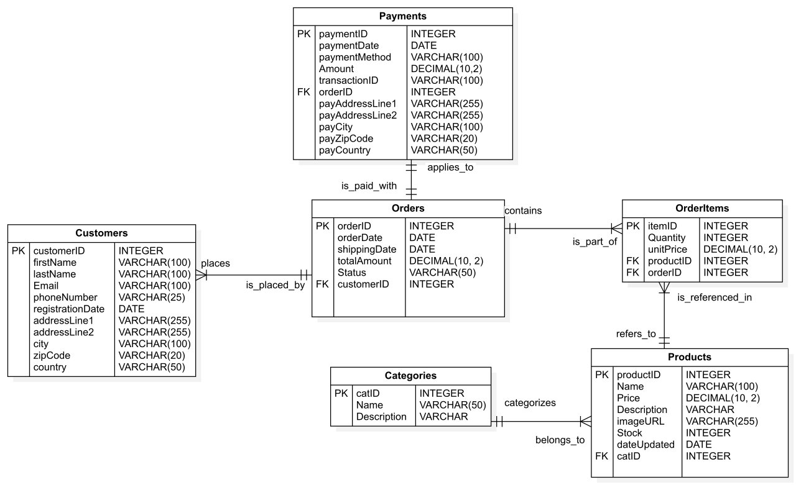
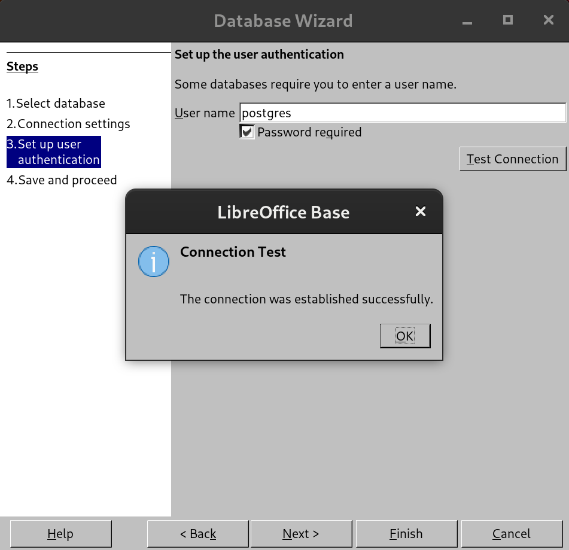
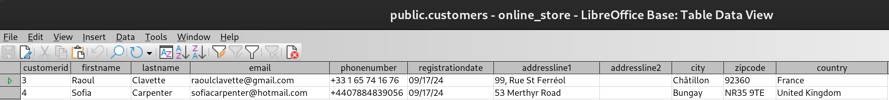
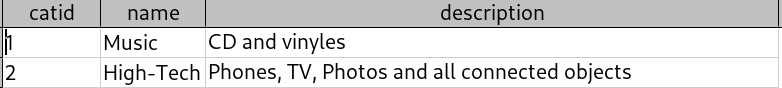
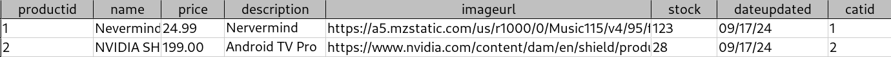
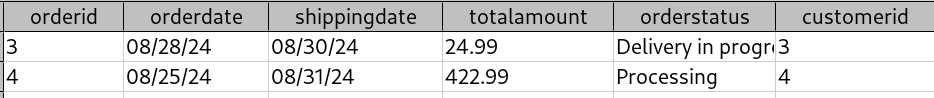
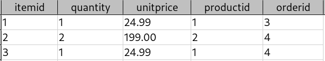
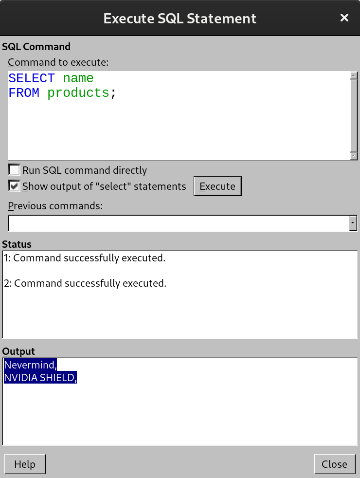
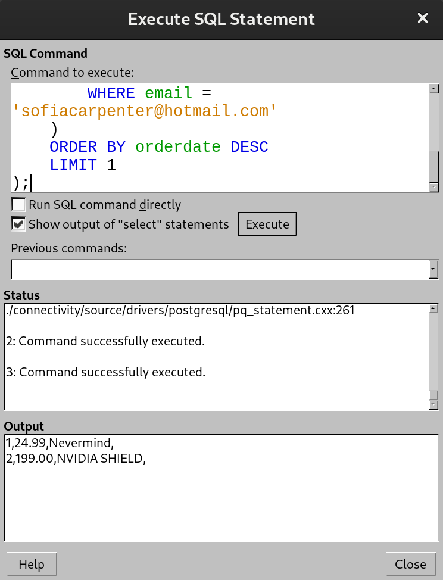

# An online store database example using PostgreSQL

## UML diagram



## Install PostgreSQL and LibreOffice Base

```bash
sudo apt update
sudo apt install libreoffice-base libreoffice-sdbc-postgresql postgresql
```

## Edit the PostgreSQL password

First, define a password for the user "postgres".

```bash
# Connect to PostgreSQL as postgres user
sudo -u postgres psql
# Change password of postgres user
\password postgres
```

Now, edit the config to connect using a password and restart the server:

```bash
# Edit the config server
sudo nano /etc/postgresql/15/main/pg_hba.conf
# Replace `local all postgres peer` by `local all postgres md5`
# Save and quit
sudo systemctl restart postgresql
```

Finally, create the database:

```sql
CREATE DATABASE online_store;
```

## Connect to PostgreSQL using LibreOffice Base

Select "Connect to an existing database" then as DBMS enter `dbname=online_store host=localhost port=5432` to connect to the database. Connect using username `postgres` and the password you chose before. Try to connect it should be working!



## Create tables

### Customers

```sql
CREATE TABLE Customers (
    customerID SERIAL PRIMARY KEY,
    firstName VARCHAR(100) NOT NULL,
    lastName VARCHAR(100) NOT NULL,
    Email VARCHAR(100) UNIQUE NOT NULL,
    phoneNumber VARCHAR(25),
    RegistrationDate DATE DEFAULT CURRENT_DATE,
    addressLine1 VARCHAR(255),
    addressLine2 VARCHAR(255),
    city VARCHAR(100),
    zipCode VARCHAR(20),
    country VARCHAR(50)
);
```

### Categories

```sql
CREATE TABLE Categories (
    catID SERIAL PRIMARY KEY,
    Name VARCHAR(50) NOT NULL,
    Description TEXT
);
```

### Products

```sql
CREATE TABLE Products (
    productID SERIAL PRIMARY KEY,
    Name VARCHAR(100) NOT NULL,
    Price DECIMAL(10, 2) NOT NULL,
    Description TEXT,
    imageURL VARCHAR(255),
    Stock INT DEFAULT 0,
    dateUpdated DATE DEFAULT CURRENT_DATE,
    catID INT REFERENCES Categories(catID)
);
```

### Orders

```sql
CREATE TABLE Orders (
    orderID SERIAL PRIMARY KEY,
    orderDate DATE DEFAULT CURRENT_DATE,
    shippingDate DATE,
    TotalAmount DECIMAL(10, 2) NOT NULL,
    OrderStatus VARCHAR(20) DEFAULT 'Please wait...',
    customerID INTEGER NOT NULL,
    FOREIGN KEY (customerID) REFERENCES Customers(customerID) ON DELETE CASCADE
);
```

### OrderItems

```sql
CREATE TABLE OrderItems (
    itemID SERIAL PRIMARY KEY,
    Quantity INTEGER NOT NULL,
    unitPrice DECIMAL(10, 2) NOT NULL,
    productID INTEGER NOT NULL,
    orderID INTEGER NOT NULL,
    FOREIGN KEY (orderID) REFERENCES Orders(orderID) ON DELETE CASCADE,
    FOREIGN KEY (productID) REFERENCES Products(productID) ON DELETE CASCADE
);
```

### Payments

```sql
CREATE TABLE Payments (
    PaymentID SERIAL PRIMARY KEY,
    paymentDate DATE DEFAULT CURRENT_DATE,
    paymentMethod VARCHAR(100),
    Amount DECIMAL(10, 2) NOT NULL,
    transactionID VARCHAR(100),
    orderID INTEGER NOT NULL,
    payAddressLine1 VARCHAR(255),
    payAddressLine2 VARCHAR(255),
    payCity VARCHAR(100),
    payZipCode VARCHAR(20),
    payCountry VARCHAR(50),
    FOREIGN KEY (orderID) REFERENCES Orders(orderID) ON DELETE CASCADE
);
```

## Add data to tables

### Add data to `Customers`

```sql
INSERT INTO Customers (firstName, lastName, Email, phoneNumber, addressLine1, addressLine2, city, zipCode, country)
VALUES
('Raoul', 'Clavette', 'raoulclavette@gmail.com', '+33 1 65 74 16 76', '99, Rue St Ferréol', '', 'Châtillon', '92360', 'France'),
('Sofia', 'Carpenter', 'sofiacarpenter@hotmail.com', '+4407884839056', '53 Merthyr Road', '', 'Bungay', 'NR35 9TE', 'United Kingdom');
```

It executed it `2 rows updated` and we can see it by checking the LibreOffice Base :


### Add data to `Categories`

```sql
INSERT INTO Categories (Name, description)
VALUES
('Music', 'CD and vinyles'),
('High-Tech', 'Phones, TV, Photos and all connected objects');
```

### Add data to `Products`

```sql
INSERT INTO Products (Name, Price, Description, imageURL, Stock, catID)
  VALUES
  ('Nevermind', 24.99, 'Nervermind album from Nirvana', 'https://a5.mzstatic.com/us/r1000/0/Music115/v4/95/fd/b9/95fdb9b2-6d2b-92a6-97f2-51c1a6d77f1a/00602527874609.rgb.jpg', 123, 1),
  ('NVIDIA SHIELD', 199.0, 'Android TV Pro Streaming Media Player; 4K HDR movies, live sports, Dolby Vision-Atmos, AI-enhanced upscaling, GeForce NOW cloud gaming, Google Assistant Built-In, Works with Alexa', 'https://www.nvidia.com/content/dam/en/shield/products/home/shield-tv-family-1024x550-t.jpeg', 28, 2);
```

### Add data to `Orders`

```sql
INSERT INTO Orders (orderDate, shippingDate, TotalAmount, OrderStatus, customerID)
  VALUES
  (DATE('2024-08-28'), DATE('2024-08-30'), 24.99, 'Delivery in progress', 3),
  (DATE('2024-08-25'), DATE('2024-08-31'), 422.99, 'Processing', 4);
```

### Add data to `OrderItems`

```sql
INSERT INTO OrderItems (Quantity, unitPrice, productID, orderID)
  VALUES
  (1, 24.99, 1, 3),
  (2, 199.0, 2, 4),
  (1, 24.99, 1, 4);
```

### Add data to `Payments`

```sql
INSERT INTO Payments (paymentMethod, amount, transactionID, orderID, payAddressLine1, payAddressLine2, payCity, payZipCode, payCountry)
  VALUES
  ('PayPal', 24.99, 'ZFZJOZF92J', 3, '99, Rue St Ferréol', '', 'Châtillon', '92360', 'France'),
  ('American Express card', 422.99, 'JPQFH1I2J20', 4, '53 Merthyr Road', '', 'Bungay', 'NR35 9TE', 'United Kingdom');
```

## Screenshot of the tables

### `Categories`



### `Products`



### `Orders`



### `OrderItems`



### `Payments`


## Some queries

### List all products name

```sql
SELECT name
FROM products;
```



### Retreive order items from latest order of a specific customer

```sql
SELECT oi.quantity, oi.unitprice, p.name AS productname
FROM orderitems oi
JOIN products p ON oi.productid = p.productid
WHERE oi.orderid = (
    SELECT orderid
    FROM orders
    WHERE customerid = (
        SELECT customerid
        FROM customers
        WHERE email = 'sofiacarpenter@hotmail.com'
    )
    ORDER BY orderdate DESC
    LIMIT 1
);
```



### Calculate total spent by a customer

```sql
SELECT SUM(totalamount) AS totalAmountSpent
FROM orders
WHERE customerid = (
    SELECT customerid
    FROM customers
    WHERE email = 'sofiacarpenter@hotmail.com'
);
```

Output:

```sql
422.99
```

### List customers and the number of orders they've buy

```sql
SELECT
    c.customerid,
    c.firstname,
    c.lastname,
    c.email,
    COUNT(o.orderid) AS nbOfOrders
FROM
    customers c
LEFT JOIN
    orders o ON c.customerid = o.customerid
GROUP BY
    c.customerid, c.firstname, c.lastname, c.email
ORDER BY
    nbOfOrders DESC;
```

Output

```sql
4,Sofia,Carpenter,sofiacarpenter@hotmail.com,1,
3,Raoul,Clavette,raoulclavette@gmail.com,1
```

### Retrieve the most popular product

```sql
SELECT
    p.productid,
    p.name AS productname,
    SUM(oi.quantity) AS totalOrdered
FROM
    orderitems oi
JOIN
    products p ON oi.productid = p.productid
GROUP BY
    p.productid, p.name
ORDER BY
    totalOrdered DESC
LIMIT 1;
```

Output:

```sql
2,NVIDIA SHIELD,2
```
